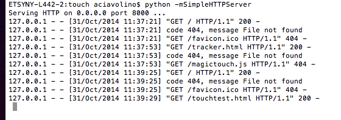
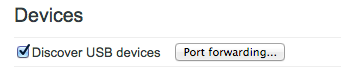
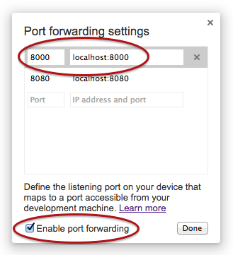
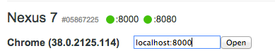
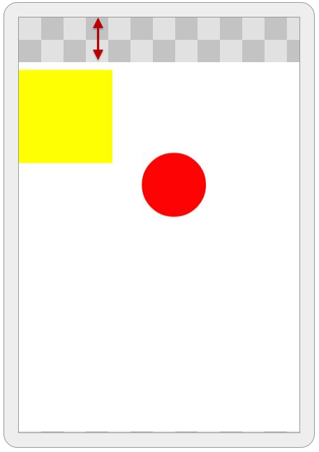

footer: Apps World 2014
slidenumbers: true

## An introduction to
# [fit] Multitouch Javascript

### By Amy Ciavolino

---

# Hi, I'm Amy

### Engineer at Etsy.com
### ~
### @imightbeAmy
---

# [fit] Multitouch Javascript

* How to test quickly
* What multitouch events are avilable
* How to use those events (with examples)

^ I'm going to give you an itroduction to what javscript and the browser has to offer in the way of mulittouch deveolpment. When you leave, I'd you should all be able to go out and start playing with this right away.

---

# [fit] Multitouch Javascript

* *How to test quickly*
* What multitouch events are avilable
* How to use those events (with examples)

---

# Testing!
## Get on a divice ASAP

^ When I do other mobile web develpment, I start on a desktop. Mainly in dev tools in chrome, and that's useually good enough for a while before I need to move to an actual device. That's no the case when doing mulit touch!

^ You can used the Chrome emulator to get one touch point, but that's not super exciting.

---

# You need to load your page on a multitouch device to *start* testing.

Want to follow along? Download the demos at
https://github.com/imightbeamy/multi-touch-js

----

# Here's a quick and easy way to do it...

---

# Use Chrome remote debugging!

---

## First run a server on your local machine

1. Put an html file in a test folder
1. cd to that folder
1. Run...
`python -mSimpleHTTPServer`



---

## Now to hook up the device

1 - Go to 
    `chrome://inspect/#devices`

^ You Can also get to this through the menu under "More tools" > "Inspect Devices" 

2 - Click "Port forwarding..."



3 - Add a line for
    `localhost:8000`
4 - Check 
    `Enable port forwarding`



---

# [fit] Plug in your device!

---

# Open `localhost:8000` on your device!



You should see the test file, open it and you're rolling.

---

# Now you can edit, save, refresh just like you normally would!

---

# [fit] Multitouch Javascript

:heavy_check_mark: How to test quickly

* *What multitouch events are avilable*
* How to use those events (with examples)

---

# [fit] Events

# [fit] `touchstart, touchmove, touchend`

---

# [fit] All three events come with:

* `touches`
* `targetTouches`
* `changedTouches`

^ But some of these are more useful than others for the three events

Also the normal event stuff...

* `target`, `currentTarget`, `preventDefault()`, ect.

---

## [fit] `touches`, `targetTouches`, and `changedTouches` 

###### ~

## are lists of *Touch* objects.

---

## What's in a Touch object?

* `identifier`
* `clientX/Y`, `pageX/Y`, `screenX/Y`
* `radiusX/Y`, `force`
* `target`

---

# Why three? 
# `clientX/Y`, `pageX/Y`, `screenX/Y`?!

`client` and `page` should mostly be the same.

Screen is using the actual screen, so it will include the browser bar, tabs etc.



--- 

# [fit] `touchstart`

---

# [fit] `touchmove`

touchmove has the messiest default behovor so always `preventDefault()`!

Don't bother with `changedTouches` here

---

# [fit] `touchend`

`changedTouches` tells you which targets were removed.

---

# Other Events

* touchcancel
* ~~touchleave~~ (Gone in the latest spec draft)
* ~~touchenter~~ (Gone in the latest spec draft)

---

# Example!

```html
<!DOCTYPE html>
<html>
<head>
    <meta name="viewport" content="width=device-width, initial-scale=1.0, user-scalable=no">
    <style type="text/css">
    
    div {
        width: 50px;
        height: 50px;
        background: red;
        border-radius: 50%;
        position: absolute;
    }
    
    </style>
    <script type="text/javascript">

    var dots = {};

    document.addEventListener('touchmove', function(event) {
        event.preventDefault();

        for (var i = 0; i < event.touches.length; i++) {
            var touch = event.touches[i],
            touch_id = touch.identifier;

            if (!dots[touch_id]) {
                dots[touch_id] = document.createElement("div");
                document.body.appendChild(dots[touch_id]);
            }

            dots[touch_id].style.top = (touch.clientY - 25) + "px";
            dots[touch_id].style.left = (touch.clientX - 25)+ "px";
        };
    });

    </script>
</head>
<body></body>
</html>
```
---

# Viewport
```html
<meta name="viewport"
    content="width=device-width,
             initial-scale=1.0,
             user-scalable=no">
```
---

```javascript
var dots = {};

document.addEventListener('touchmove', function(event) {
    event.preventDefault(); // Always have this for touchmove

    for (var i = 0; i < event.touches.length; i++) {
        var touch = event.touches[i],
        touch_id = touch.identifier;

        if (!dots[touch_id]) {
            dots[touch_id] = document.createElement("div");
            document.body.appendChild(dots[touch_id]);
        }

        dots[touch_id].style.top = (touch.clientY - 25) + "px";
        dots[touch_id].style.left = (touch.clientX - 25)+ "px";
    };
});
```

---

# CSS

```css
div {
    width: 50px;
    height: 50px;
    background: red;
    border-radius: 50%;
    position: absolute;
    -webkit-transform: translateZ(0);
}
```
### (Hack alert)

---

# The Hack

Adding...

```css
-webkit-transform: translateZ(0);
```
puts an element in it's own render layer.

This means a lot less painting.

---


---

## You have to move your figure before the point will register.
# Let's fix that.

---

```javascript
var touches = [], dots = {};

function drawDots() {
    for (var i = 0; i < touches.length; i++) {
        var touch = touches[i];
        //... Same as before
    };
}

document.addEventListener('touchmove', function(event) {
    event.preventDefault();
    touches = event.touches;
});

document.addEventListener('touchstart', function(event) {
    touches = event.touches;
});

(function loop(){
    drawDots();
    window.requestAnimationFrame(loop);
})();
```
---

## Can also use `changedTouches` to remove the dots when you lift your figure.

---

```diff
-   var touches = [], dots = {};
+   var touches = [], removedTouches = [], dots = {};
 
    function drawDots() {
        for (var i = 0; touches && i < touches.length; i++) {
            // ... Same as before
        };
+
+       for (var i = 0 ; removedTouches && i < removedTouches.length; i++) {
+           var touch = removedTouches[i],
+               touch_id = touch.identifier;
+
+           if(dots[touch_id]) {
+               dots[touch_id].remove();
+               dots[touch_id] = null;
+           }
+       };
+       removedTouches = null; // Reset them
    }
 
+   document.addEventListener('touchend', function(event) {
+       removedTouches = event.changedTouches;
+   });
```

---

# Drag and drop

## A use for targetTouches

---

```javascript
var divs = document.querySelectorAll('div');

for (var i = divs.length - 1; i >= 0; i--) {
    divs[i].addEventListener('touchmove', function(event) {
        event.preventDefault();
        var touch = event.targetTouches[0];
        this.style.top = (touch.clientY - 25) + "px";
        this.style.left = (touch.clientX - 25)+ "px";
    });
}
```

---

## Find this code at
## github.com/imightbeamy/multi-touch-js

`log_events.html`
`simple.html`
`simple_with_animation_loop.html`
`simple_with_remove.html`
`drag_and_drop.html`
`pong.html`

---

## Build awesome multitouch things, and let me know about them
# @imightbeAmy
### or find me otherways at amyciavolino.com

